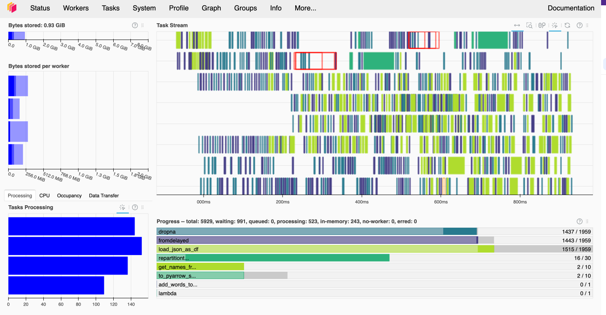
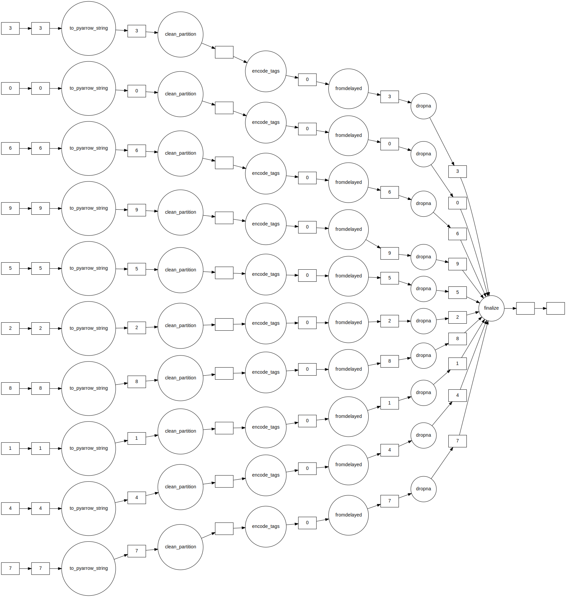
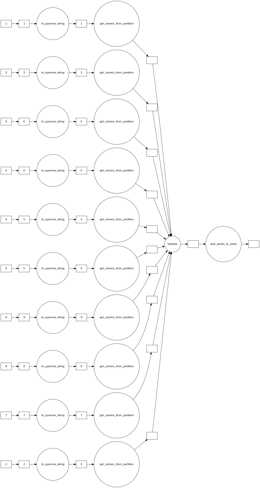
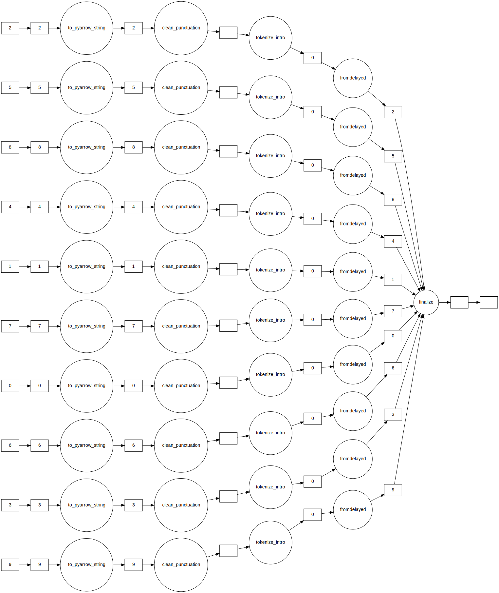
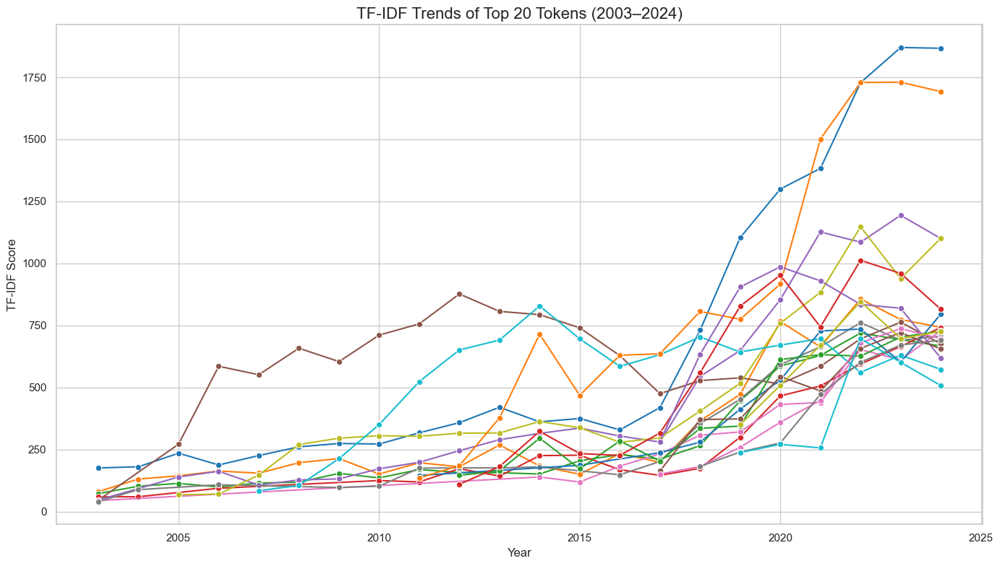
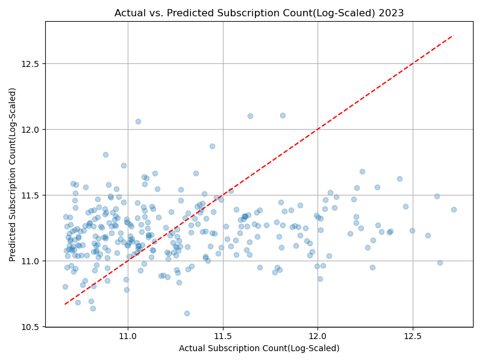
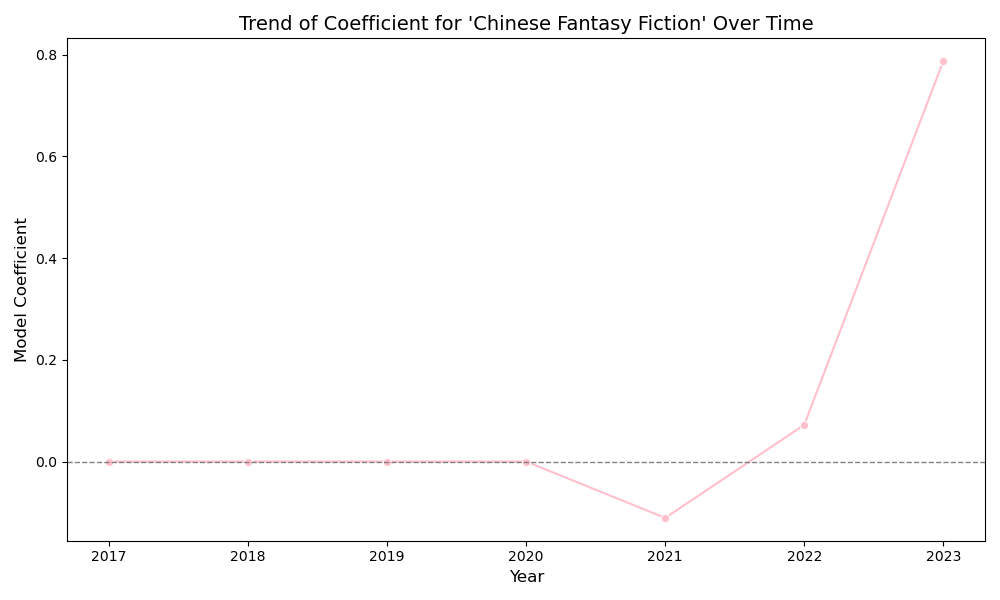

# Cues for the Collective: The Cultural Significance of Online Novel Trends

This repository houses the code, presentation materials, and report for Yilin Xu's MACS 30123 Final Project: Cues for the Collective: The Cultural Significance of Online Novel Trends, which aims at exploring serialized online novel market's trends and their potential in informing researchers valuable insights about public opinions among the reader population.

Below is an overview of the README's contents:
| Section          | Description                                   |
|------------------|-----------------------------------------------|
| [Github Repo Navigation](#github-repo-navigation) | Guide to navigating this repository |
| [Requirements](#requirements) | Information about Python versions, packages used, and supplementary materials required to reproduce the workflow |
| [Project Description](#project-description) | 	Overview of research question, motivation, background information and application of parallelism|
| [Parallel Data Collection Pipeline](#parallel-data-collection-pipeline) | Instructions on running the code to replicate the data collection process |
| [Dask Exploratory Data Analysis](#dask-exploratory-data-analysis) | Exploratory data analysis results |
| [Citations](#citations) | Citations |
| [To Cite this Project](#to-cite-this-project) | Instructions on how to cite this project |

## Github Repo Navigation
    .
    ├── generate_batches.py
    ├── launch_scraper_pipeline.py
    ├── launch_scrapers.py
    ├── sampling_scraper.py
    ├── book_scraper.py
    ├── online-novel-trend.ipynb
    ├── online-novel-jjwxc-dict.txt
    ├── stopwords-zh.txt
    ├── novel_intro_tfidf_trend.html
    ├── requirements.txt # Requirements for packages and versions
    ├── images
    └── README.md

## Requirements
### Accessing Scraped Data
All Scraped Data are stored in this [Google Drive](https://drive.google.com/drive/folders/1P9QsLA2oX9jpJZfC1UbpbQ1bkda2xI0b?usp=sharing). 

### Basic Packages and Versions
The code is written in Python 3.9.16 and all of its dependencies can be installed by running the following in the terminal (with the requirements.txt file included in this repository):
```
pip install -r requirements.txt
```

### Custom Dictionary and Stopwords
This project leverages a custom dictionary `online-novel-jjwxc-dict.txt` and a stopwords list `stopwords-zh.txt`. Both files can be found in this repository.  

## Project Description

### Research Motivation
**I propose that trends in successful online novels can serve as indicators of shifting public norms and evolving societal mindsets, especially when considered alongside the characteristics of the reader population.**

### Social Science Relevance  
"A reader lives a thousand lives before he dies . . . The man who never reads lives only one." This quote speaks not only to the immersive power of literature but also to its enduring appeal as a form of emotional and psychological entertainment. Reading allows individuals to momentarily escape their own realities and inhabit the lives, emotions, and decisions of fictional characters. This capacity for narrative transport is at the heart of why readers return to stories again and again. Serialized storytelling has long held a unique place in global entertainment, from Dickensian novels to contemporary streaming series. In China, serialized online novels have evolved into a massive grassroots literary phenomenon, driven by a dynamic reader-author feedback loop. Platforms empower individual writers to publish content chapter-by-chapter, enabling real-time responses from readers and creating a data-rich environment for analyzing the interplay between narrative structure and audience engagement.  

The reader-response theory highlights the significant role readers and their personal experiences play in forming interpretations of the text. Wolf- gong Iser, a foundational scholar in reader-response criticism, proposed the possibility of leveraging this perspective for literary anthropology. When a piece of text elicits reactions from a reader, it also ”reveal ... [individualistic] dispositions, desires, inclinations and ... overall makeup [about the reader].”(Iser, 1993) A single text can yield multiple valid in- terpretations depending on who is reading it and under what circumstances. The theory has been adapted to investigate new emerging forms of media and products in consumer behavior research(Scott, 1994). Following this logic, an emphasis on consumption rather than production of media contents allows researchers to understand collective preferences and trends.  

This study proposes to investigate reader reception and preferences on one online serialized novel platform through success quantified with number of subscriptions, reviews, and variations in click counts each chapter. The availability of real-time reader feedback create a feedback-rich environment where authors, incentivized by financial rewards tied to reader subscriptions, must continuously adapt to meet evolving reader expectations. They have to make many decisions aiming to optimize the reading experience of the readers. This author-reader dynamic is comparable to other forms of serialized modern entertainment, where success hinges on sustained resonance with an audience. Thus, analyzing online novels offers a lens into collective reader preferences and emotional triggers, shaped by textual content, social context, and platform-specific norms. Hence, success of an online novel reflects its alignment with general preferences of the reader population, which allows us to make inferences and propose further questions about how basic demographic attributes like gender or focus on romance elements impact preferences. Since the platform this study collects data from has predominantly female users, the data provides a valuable chance to investigate rise of feminism and queer discourse in Chinese online novels.  

### Background - China's Online Novel Market
Since online novel platforms are not popular in the U.S. I decide to include a brief description of China’s online novel market as background information. I will also explain how China’s online novel market resembles and differs from other serialized entertainment industry using Netflix as example. Despite waves of state efforts in sanctioning certain topics, the online literature market in China remains a relatively loosely monitored grassroots alternative to traditional publishing businesses(Zhao, 2017). Although the first serialized online novels were written mainly by amateur writers and literary enthusiasts without financial incen- tives, the online literature market has evolved to become competitive and predominantly profit driven. According to China Internet Network Information Center (CNNIC)’s latest report published in August 2024, 516 million people, which is approximately 46.9% of the total Internet users in China, consume online literature (China Internet Network Information Center, 2024).  

The business model of a typical online novels platform is simple. There is close to zero barriers to entry. Anyone can register as an author and publish novels. If their chapters receive enough attention (views, subscriptions, etc.), online editors working for the platform will reach out with a contract. When one novel gathers enough subscriptions and has achieved enough word counts, authors can then label later chapters as VIP only (pay-to-read). Readers can purchase to read chapter by chapter. The price of a VIP chapter depends on the word count. Usually, it is calculated in terms of few cents per thousand words. The revenue is divided evenly or close to 6:4 between the author and the platform. Readers can also decide to pay additional tips to the author only. For successful novels, there will be opportunities for paper publications and IP adaptations, which generates far larger amount of profits for the authors. Hence, it is crucial for the author to pay attention to reader response and strategically adjust future chapters if they are financially motivated.

China’s online novel market and Netflix share similarities in their business models, as both rely on serialized content to retain audience engagement and generate revenue. Like Netflix, which releases series in episodes to maintain viewer interest and subscription renewals, online novel platforms publish content in chapters, allowing authors to build anticipation and monetize subsequent releases. However, a key difference lies in the accessibility and entry barriers for creators. While Netflix curates its content through professional production and licensing agreements, online novel platforms permit virtually anyone to publish and monetize their work, creating a more grassroots and open-entry ecosystem. Additionally, whereas Netflix typically negotiates content rights and offers creators fixed payments or royalties, Chinese online novel platforms often operate on a pay-per-chapter model, allowing authors to directly profit based on reader engagement, tipping, and subscription sales. These structural differences lead to divergent content ecosystems. On online novel platforms, the low financial and technical barriers to entry encourage a high volume of new works, but also result in a high dropout rate among authors. Because many writers produce content alongside other employment and face unstable or modest earnings, the likelihood of a novel continuing to update over time is relatively low. This creates a dynamic, yet highly precarious creative environment where audience reception can determine not only a story’s direction but also its survival.

### Data Collection Site Selection  
Since there are no publicly available datasets that track subscriptions, view counts, recommendation votes, and content of online novels in China, this project implements a parallel web scraping workflow to collect samples, update sample statistics at regular intervals, and collect the text data of all free chapters after the update process is completed. The project focuses solely on collecting data from JJWXC, a platform with predominantly female readers and writers and thriving feminism and queer culture compared to other platforms.  

### Parallelism  
There are two main components in the project that leverages large-scale computing tools and strategies covered in MACS 30123. 
1. Parallel Scraping: A parallel scalable scraping pipeline leveraging Amazon AWS services(EC2, S3, SNS, EventBridge) is implemented to collect sample data.  
2. Dask-based Exploratory Data Analysis: Dask on local machine is used to facilitate and accelerate the process of data loading, preprocessing, descriptive analysis, and tentative linear modeling of success. 


## Parallel Data Collection Pipeline
This section outlines the (recommended) order by which the users can reproduce the scraping results with the code:  
- Step 0: Generating Pages
  This step generates the pages to scrape. Run:  
  ```
  python3 generate_batches.py --num_batches INT
  ```
  Then, the terminal will ask the user to input what ranking they want to scrape. My scraping process collects top 1,000 novels from all originality type and romance type for start year 2003 till end year 2024.
  ```
  Enter start year (2003–2024):
  Enter end year (2003–2024):
  Enter originality (All - 0, Original - 1, or Fan-fiction - 2):
  Enter romance type (All - 0, Heterosexual - 1, Gay - 2, Lesbian - 3, Aromantic - 4, Multi - 5): 
  ```
  This will generate num_batches csv files with each line containing information about year, originality, romance, and pagenumber, which will be passed into the sampling_scraper.py.  
- Step 1: Setting Up S3 Bucket
  Run 
  ```
  python3 launch_scraper_pipeline.py --s3_bucket 'online-novel-trend'(DEFAULT) \
                                     --num_batches 8(DEFAULT) \
                                     --email REQUIRED
  ```
  The email sends notifications when a EC2 instance finishes its job and is terminated.  
- Step 2: Sampling
  Run 
  ```
  python3 launch_scrapers.py --job 'page'(REQUIRED) \
                           --s3_bucket 'online-novel-trend' (DEFAULT) \
                           --ami_id 'ami-00a929b66ed6e0de6' (DEFAULT) \
                           --instance_type 't2.micro' (DEFAULT) \
                           --key_name 'vockey' (DEFAULT) \
                           --iam_instance_profile 'LabInstanceProfile' (DEFAULT) \
                           --num_batches 8 (DEFAULT) \
                           --year 2024 (DEFAULT)
  ```
  to automatically collect samples of 1000 books ranked by subscription counts from specified year range. The scraper stores multiple JSON file in the S3 bucket formatted as `book_batches_<year>_<originality>_<romance>_<pagenumber>.json`.
- Step 3:
  Run `launch_scraper.py`, specify job as 'book' and change year parameter to change which JSON files containing links to individual books gets scraped(search by prefix).  
  ```
  python3 launch_scrapers.py --job 'book'(REQUIRED) \
                           --s3_bucket 'online-novel-trend' (DEFAULT) \
                           --ami_id 'ami-00a929b66ed6e0de6' (DEFAULT) \
                           --instance_type 't2.micro' (DEFAULT) \
                           --key_name 'vockey' (DEFAULT) \
                           --iam_instance_profile 'LabInstanceProfile' (DEFAULT) \
                           --num_batches 8 (DEFAULT) \
                           --year 2024 (DEFAULT)
  ```
  This will store scraped book's data in individual JSON files inside a folder s3_bucket/<year>_<originality>_<romance>/. Individual JSON files contain tjhe following information:
  Book ID, Author ID, Author, Novel Title, Novel Introduction, Tags, Summary,
    Motivation, Characters, IP adaptations, Awards, Genre, Perspective, Update Status, 
    Word Count, Contract Status, Review Count, Subscription Count, Free Chapters' Texts.

An attempt to collect book data in serial seggests that 250 novels took 200+ minutes. Parallism using AWS EC2 services saves a lot of time to collect the samples. 

Notice this pipeline does not guarantee zero errors as JJWXC provides the authors a lot of flexibility in customizing the novel page and some pages deprecate/are slower to access as they date back in publish time. Overall, my scraping attempt shows that errors rarely occur(0.0003%).  

## Dask Exploratory Data Analysis
Here, I present some results from exploratory data analysis on my local machine with Dask. Note this process can also be done on Midway or EC2 Cluster with AWS. In the [online-novel-trend](online-novel-trend.ipynb) Jupyter Notebook, sample codes were provided on how to setup and run the notebook on Midway.  

### Data Preprocessing
The data preprocessing can be divided into two components: attributes preprocessing and text preprocessing.  

#### Cleaning Attribute
I developed a pipeline to clean attribute data.  
The delayed `clean_partition` function 1) standardizes and shortens summary and motivation texts; 2) produce binary variables indicating whether the author is contracted with the platform, whether the novel is completed; 3) counts number of awards and number of IP adaptations each novel has; 4) ensure word count, review count, and subscription count are numeric values; 5) convers subscription count to log-scale as success exhibits power-law distribution pattern; and 6) splits Genre column with '-' into four columns Originality, Romance, Setting, and Theme.  
The delayed `encode_tags` function expands the Tags column which contains unknown number of tags seperated by ', ' in each row and add to the original dask dataframe all possible tags as new columns of binary values indicating presence.  
Here is this step's task graph:


#### Cleaning Text Data
Text preprocessing can be performed on introductions and free chapters' texts. In this project, I used the texts from novel introductions as I hypothesize they are more information-rich compared to novel chapters.  
- Adding Character Names to Jieba Dictionary  
I added the character names in my Jieba dictionary to ensure more accurate tokenization results. I have to perform this step so names will be recognized and then removed using stopwords in later processes. This step's task graph is visualized here.  
  
- Text Preprocessing  
The delayed `clean_punctuation` function removes punctuations from the text data. The punctuations include basic English and Chinese punctuations as well as other symbols discovered through trial and eror.  
The delayed `tokenize_intro` function performs the tokenization process in the following steps: 1) generate novel-specific stopwords from character names and novel title and combine with basic stopwords imported earlier; 2) use `list(jieba.cut(text, cut_all=False))` to segment texts; 3) filter generated tokens.  
Here is this step's task graph:


### Token Prevalence Trend in Novel
A custom TF-IDF process is used to analyze token prevalence across years. Jieba's own jieba.analyse.extract_tags() function provides a tfidf analysis pipeline. However, it uses a general idf is not situated in the online novels ecosystem.  
My custom TF-IDF process uses the Cleaning Text Data pipeline as described above and goes through a common tfidf calculation procedure. Then, the top 300 tokens from each year is saved together with their tf-idf score. The top 20 tokens were selected among all years based on their maximum tfidf score. Then, their scores in other years were traced. If they were not present, 0 is used to fill out the NA values.   
Here is the result of token prevalence trend in the top novels from year 2003 to 2024:  
  
I also generated a [Bokeh Interactive Plot](images/intro_tfidf_trend.html) to show the trend of top 20 tokens' occurances across years.  

### An Attempt of Modeling  
A ridge model is trained for each year from 2003 to 2024 to explore how tags, perspectives, update status, originality, romance type, setting, theme, and contract status contributes to success of a novel, quantified by log-scaled subscription count, in different years. The importance of features demonstrate trends in popularity over time which reflects preferences and opinions from the reader population.    
The modeling process is not entirely parallized. The data loading and preprocessing needed to prepare the data for modeling is parallize and subsequent steps of categorizer, dummy encoder, and ridge model fitting are not parallized. This choice is made because it is limited improvements can be provided as my data size is relatively small with around 220 features and 700 to 1000 data points for each year.    
- **Example**  
A modeling demo done with data from 2023 has metrics:  
```
RMSE: 0.25520422175756596
R² Score: -0.06313805452757393
```
This means that predictions are off by about 0.255 units on average. The model is not learning any useful pattern in the data for this year — it’s likely overfitting, underfitting, or using irrelevant features. Future work will explore other models which may perform better than a simple L2 linear regression.  
  
Still, we can look at the feature importance:  
```
Top positive contributors:
    Feature  Coefficient
216    国风幻想     0.786900
69       唐穿     0.676479
144      虫族     0.649484
57     神话传说     0.601504
52       暖男     0.510909
215      秦穿     0.467926
71       吐槽     0.421452
176      热血     0.399029
203      权谋     0.393052
47     三国穿越     0.387239

Top negative contributors:
      Feature  Coefficient
243  Theme_剧情    -0.234118
67         虐文    -0.234572
25         生子    -0.246076
119        腹黑    -0.259850
51        古穿今    -0.264390
181      史诗奇幻    -0.289522
97         开挂    -0.295862
76        反套路    -0.348386
74        红楼梦    -0.410934
126        机甲    -0.413185
```
**Interpretation:**  
The rise of narratives centered on Chinese history, mythology, and dynastic time travel may reflect deeper currents of social cohesion and national identity. By revisiting shared cultural touchstones—such as legendary figures, dynastic eras, and foundational myths—these stories foster a collective memory that strengthens social bonds. In doing so, they not only entertain but also contribute to the symbolic recognition of the nation as a distinct cultural entity with a rich and continuous past. This symbolic reaffirmation nurtures a "national spirit", reinforcing pride in cultural heritage and a sense of unity in an increasingly globalized and digitized world. Through literature and media, such themes offer a space where historical imagination becomes a tool for cultural continuity, identity affirmation, and soft power projection.  


**Reflection**:  
The modeling is rudimentary and needs more work to 1) select a better model and 2) account for sparse data structure.  

## Citations
- China Internet Network Information Center. (2024). The 54th statistical report on china’s internet development. Retrieved April 12, 2025, from https://www.cnnic.com.cn/IDR/ReportDownloads/202411/P020241101318428715781.pdf
- Iser, W. (1993). Prospecting: From Reader Response to Literary Anthropology. Johns Hopkins University Press. https://books.google.com/books?id=gdkVU3coqbcC
- Scott, L. (1994). The bridge from text to mind: Adapting reader-response theory to consumer research. Journal of Consumer Research, 21, 461–80. https://doi.org/10.1086/209411
- Zhao, E. J. (2017). Writing on the assembly line: Informal labour in the formalised online literature market in china. New Media & Society, 19(8), 1236–1252. https://doi.org/10.1177/1461444816634675

## To Cite this Project
Please cite this repository as: Xu Y, Cues for the Collective: The Cultural Significance of Online Novel Trends, (2025), GitHub repository, https://github.com/macs30123-s24/final-project-online-novel-trend

